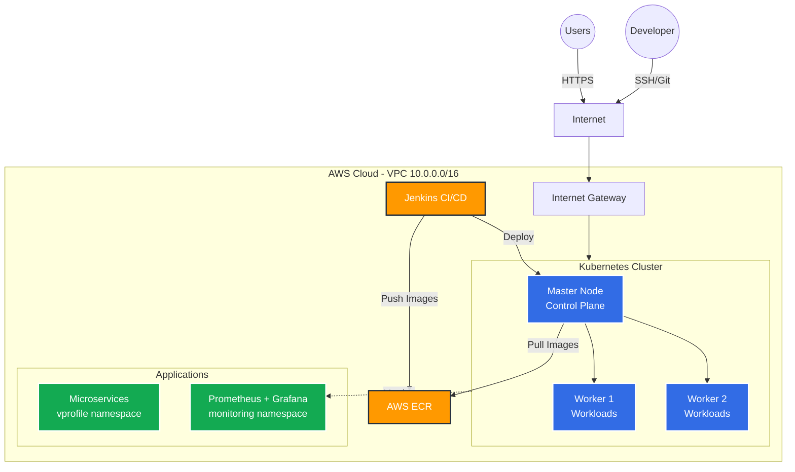

<h3 align="center"> Deploy 3-tier app </h3>

### Architecture

### Components

**Network Layer:**
- VPC with CIDR 10.0.0.0/16
- Public Subnet: ALB, NAT Gateway, Bastion Host
- Private Subnet: Kubernetes cluster (master + workers)
- CI/CD Subnet: Jenkins server (isolated)
- Security Groups: Strict ingress/egress rules per component

**Kubernetes Cluster (kubeadm):**
- 1 Master Node
- 2 Worker Nodes
- CNI Plugin: Calico/Cilium (NetworkPolicy support)
- Namespaces: `vprofile` (apps), `monitoring` (observability)

**Monitoring:**
- Prometheus: Metrics collection
- Grafana: Visualization dashboards
- Node Exporters: System metrics
- CloudWatch: Centralized logging and alarms
